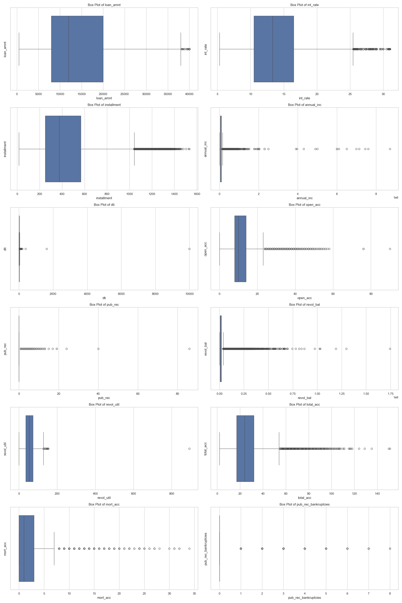
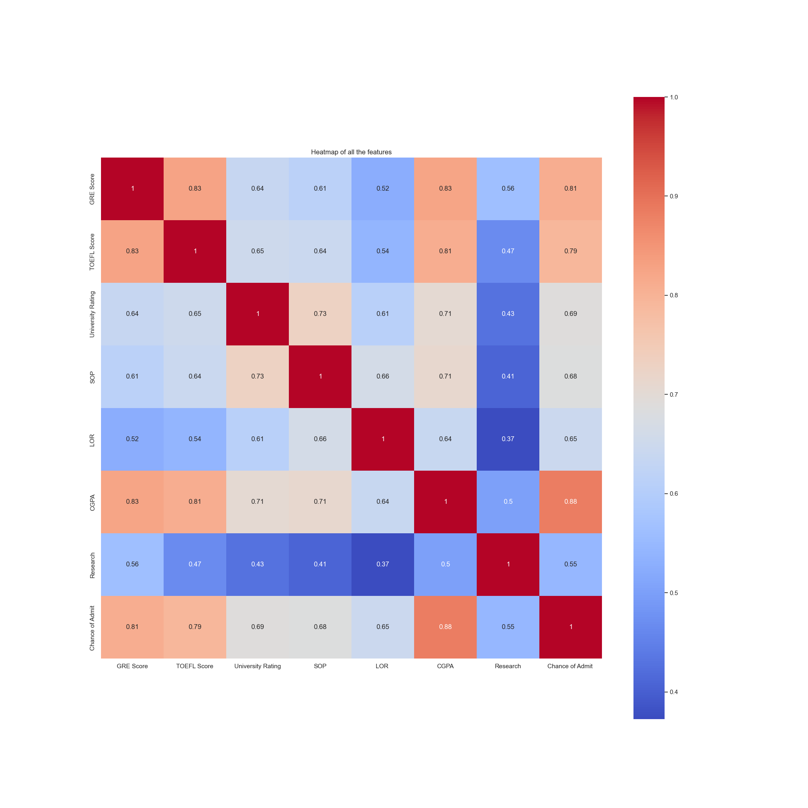
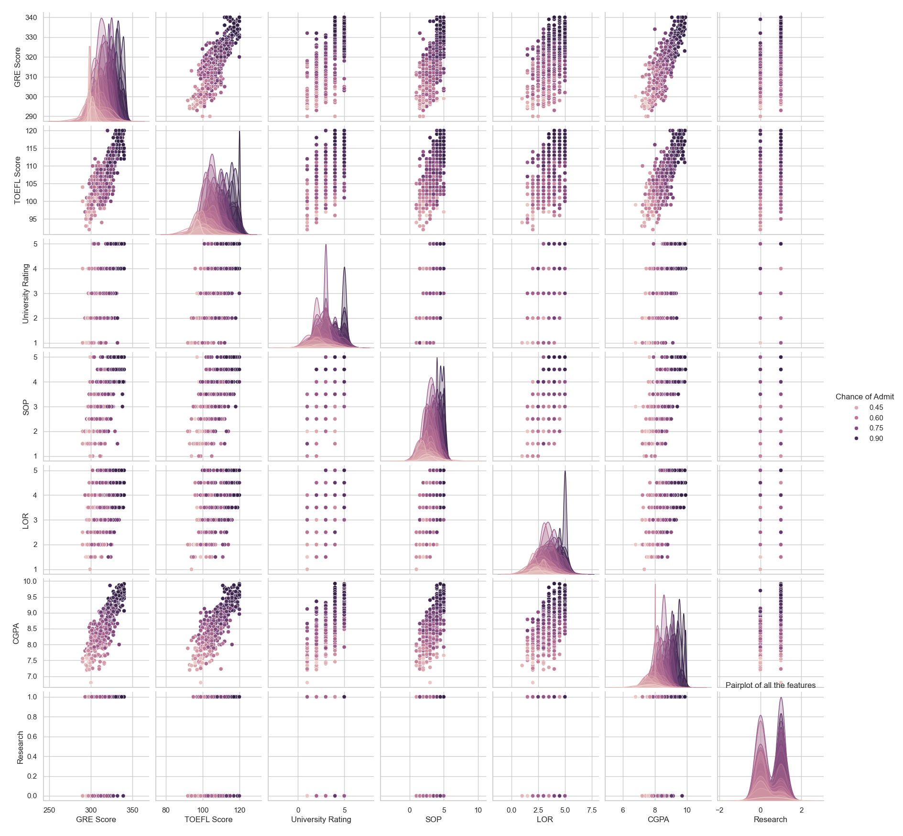
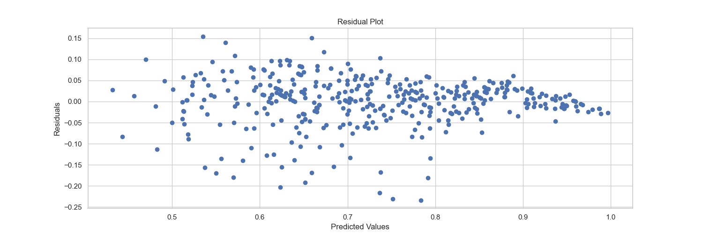
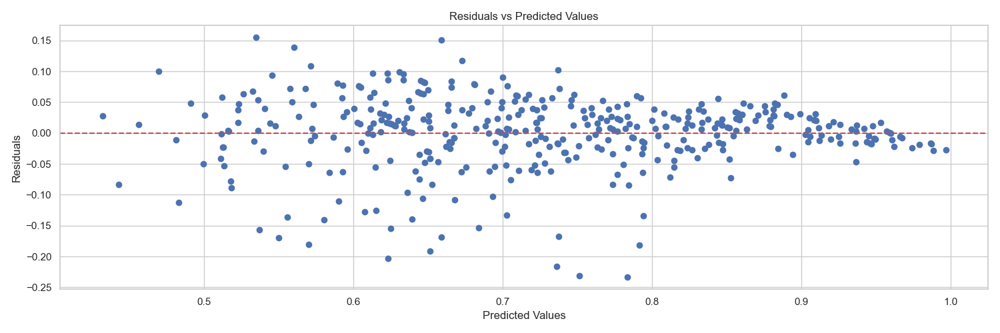
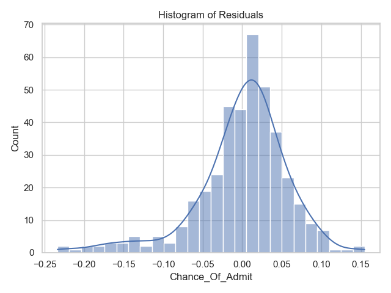
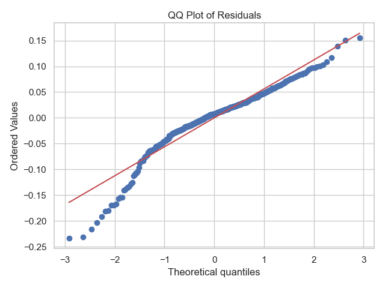
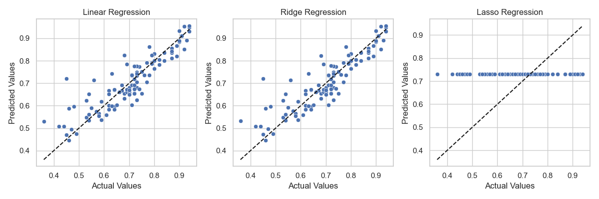

# Introduction
Each year millions of students apply for admissions into universities across the world. Education consultants like Jamboree, Edwise, LeepScholar, etc, assess different features surrounding the application of a student like, GRE score, ILETS score, TOEFL score, etc and calculate the chance of admission of a student into a university.

To automate this task, a Linear Regression model is trained using a dataset containing 9 relevant features. The model then, for a new data point, predicts the chance of admission of a student into a university.

# Insights
The distribution plots of all the numerical columns is as follows,


The box plots of all the numerical columns is as follows,



Comments,
- A few outliers can be seen in the box plots of LOR and Chance of Admit.
- The distribution plots of GRE Score, TOEFL Score, and CGPA show a normal distribution.
- Most number of Universities have a rating of 3.
- Most students who have applied have a research experience.

The heatmap showing the correlation between all the columns is as follows,



The pair plots of all the columns is as follows,



Comments,
- The correlation shows that there is strong correlation between Chance of Admit with GRE Score, TOEFL Score and CGPA.
- There is a strong correlation between University Rating and SOP.
- GRE Score and TOEFL Score have a high correlation. Meaning, students/ learners who have performed well in one, have also performed well in the other.
- The CGPA has a strong correlation with GRE Score and TOEFL Score. This means that students/ learners who have done well in the GRE and TOEFL exams have also done well during their education.
- Most number of students/ learners who are doing research have received a University Rating of 4 and 5.
- Student/ learner who are doing research have a higher CGPA.
- As the TOEFL and GRE Scores increase, the CGPA is also increasing.

# Deployment Steps
### Virtual environment setup
1. `cd <project_directory_path>`.
2. `pip install virtualenv`.
3. `python<version> -m venv <virtual_environment_name>` or `python3 -m venv .venv`.
4. A folder named "`.venv`" will appear in the project directory.
5. Activate the virtual environment using one of the commands listed below depending on the Operating System,
    - MacOS and Linux, `source .venv/bin/activate`.
    - Windows command prompt, `.venv/Scripts/activate.bat`.
6. Once the virtual environment is active, the environment name (in this case "`.venv`") will be visible in the parantheses before the prompt, like so "`(.venv)`".
7. To confirm if the virtual environment has successfully been create, run `pip list`. The following should be the output,
```
(.venv) vidish@Vidishs-MacBook-Air network_anomaly_detection % pip list
Package    Version
---------- -------
pip        xx.x.x
setuptools xx.x.x
``` 
8. To deactivate the virtual environment, strictly run the following 2 commands in the same order,
    - `deactivate`.
    - `rm -r .venv`.

### Installing dependencies
1. Once the virtual environment is created, create a `.txt` file named, `requirement.txt`.
2. Add the names of the dependent (required) packages (libraries) that are required by the app to be functioning. The below is the list of packages that are required,
```
flask
pickle
pandas
scikit-learn
```
3. Once the `requirement.txt` file is created with all the dependencies included as a part of the file, save the file and run `pip install -r requirements.txt` from the terminal.
4. `pip list` can be run to check if the installation of all the packages has been successful.

### University admission predictor model
A Linear Regression model is built to perform the task of prediction. The following are model's performance statistics,
- Training performance = 0.8261392753723373
- Test performance = 0.7958581715074224
- MSE = 0.003673319896222301
- R2 Score = 0.7958581715074224
- MAE = 0.043640469350628194
- RMSE = 0.060607919418359024
- Adjusted R2 Score = 0.7929358958439295

The following plot shows the model's coefficients,


The following are the results from tests conducted to confirm the assumptions of Linear Regression model,
1. Multi-collinearity check using VIF score,
    - The check for multi-collinearity is PASS. All the VIF Scores are below 5, which is the defined limit.
        
        | column_name | vif_score |
        | :-: | :-: |
        | GRE_score | 4.34 |
        | TOEFL_score | 3.65 |
        | University_rating | 2.70 |
        | SOP | 2.93 |
        | LOR | 2.11 |
        | CGPA | 4.98 |
        | Research | 1.51 |

2. The mean of residuals is nearly zero,
    - Mean of Residuals = 5.033756786713556e-18
    - The check for mean of residuals is PASS. The mean of residuals in nearly zero.
3. Linearity of variables,
    - The check for linearity of variables is PASS. There is no discernable pattern observed in the below residual plot.

    

4. Test for homoskedasticity,
    - The check for Homoscedasticity is PASS.

    

5. Normality of residuals,
    - The check for normality of residuals is PASS. As seen below, the an almost bell-shaped curve is observed in residuals distribution, and the points in QQ plot are all almost on the line.

    

    

The following plots show the comparison of Linear Regression model with Ridge and Lasso Regression models,



It is observed that both Linear Regression and Ridge Regression have a similar accuracy, while the Lasso Regression has oversimplified the model.

### University admission predictor app
1. To run the application,
    - `cd src`.
    - `FLASK_APP=university_admission_predictor_app.py flask run`.
2. To view the welcome page, goto, http://127.0.0.1:5000.
3. To get a prediction of chance of admission, send a POST request to, http://127.0.0.1:5000/predict.
4. The POST request can be sent by running the following command in a terminal window:
```
curl -X POST -H 'Content-Type: application/json' -d '{"gre_score": 300, "toefl_score": 100, "university_rating": 4, "sop": 3, "lor": 4, "cgpa": 8.90, "research": "Yes"}' http://127.0.0.1:5000/predict
```
5. Expected response: `{"chance_of_admit":0.7240366948427613}`.

# API Specification
### Base URL
http://127.0.0.1:5000

### Endpoints
- GET `/`: Returns a text indicating the application's purpose.
- POST `/predict`: Returns an output indicating the chance of admission.

### Request format for POST /classify
Content-Type: application/json

The request body should be a JSON object containing the following features of a network connection,
- `gre_score`: GRE score (out of 340).
- `toefl_score`: TOEFL score (out of 120).
- `university_score`: University rating (out of 5).
- `sop`: Statement of purpose (out of 5).
- `lor`: Letter of recommendation (out of 5).
- `cgpa`: CGPA from the previous degree (out of 10).
- `research`: Research experience ("Yes" or "No").

### Response format for POST /classify
The response will be a JSON object with the following key,
- Chance of Admit: A floating-point representing the chance of admission.
