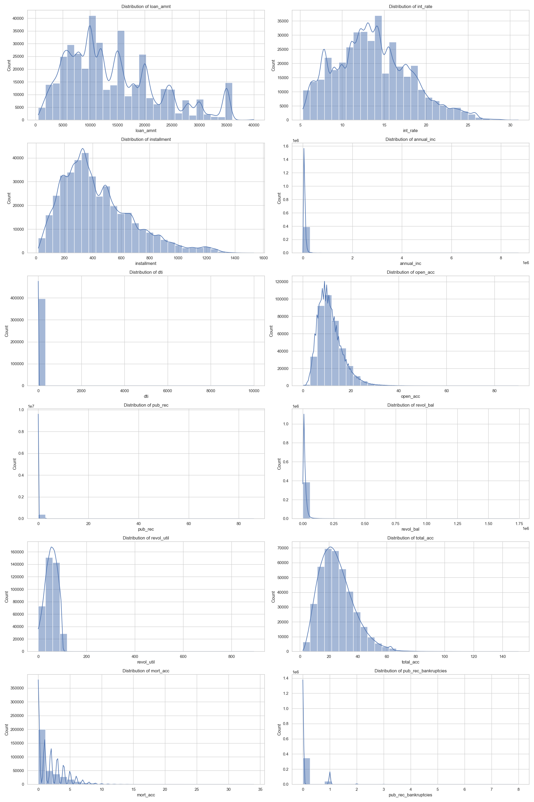
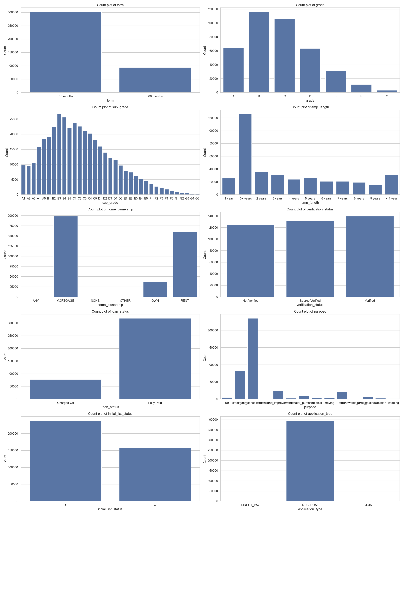
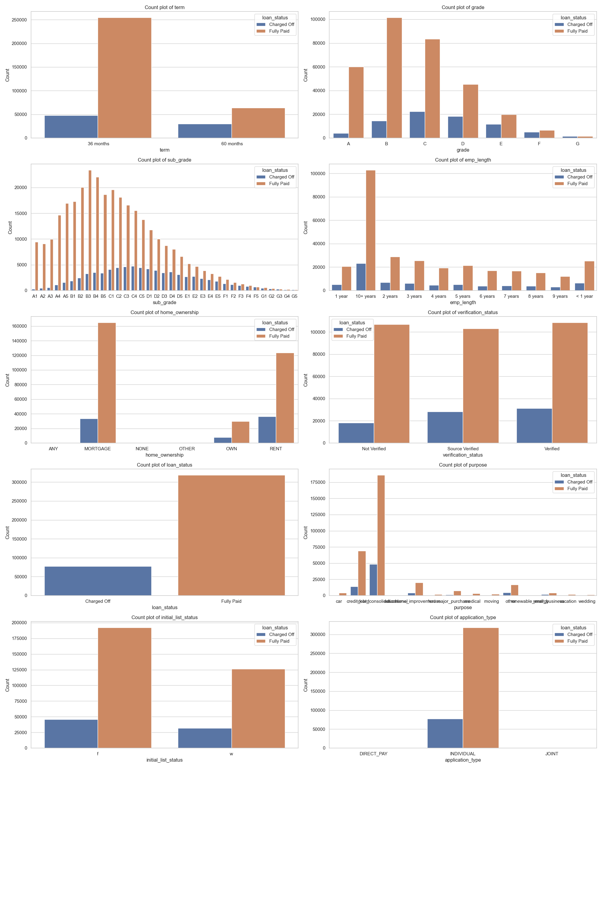
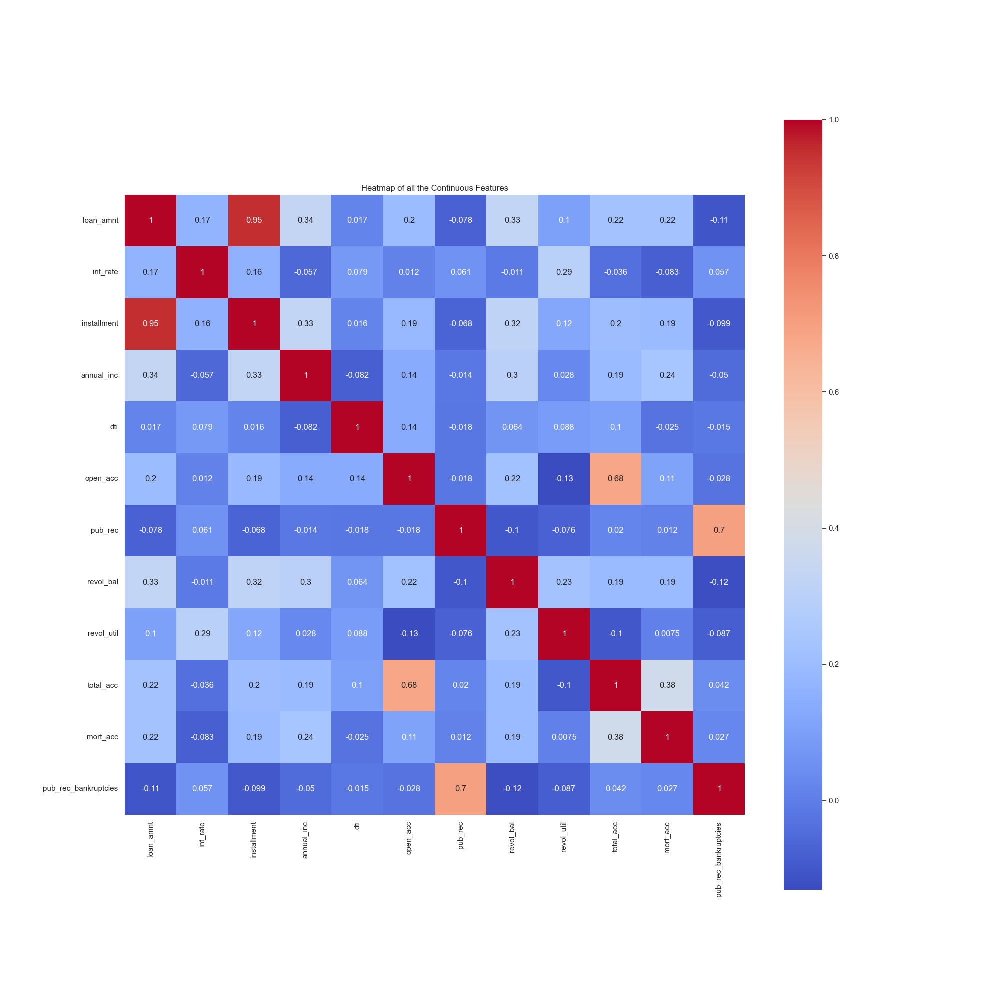
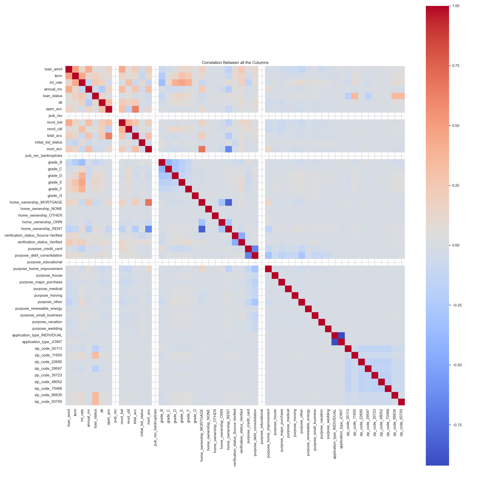
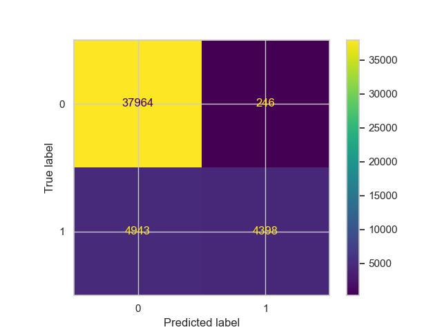
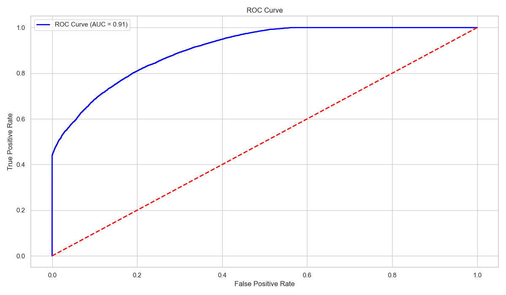
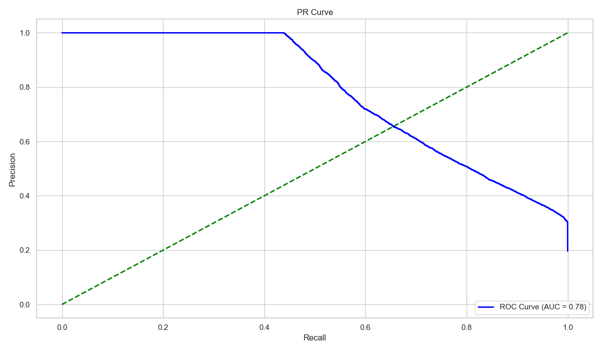

# Introduction
A loan underwriter is a financial professional who evaluates loan applications to determine the risk involved in lending money to a borrower. They play a crucial role in the leading process by assessing the borrower's creditworthiness and ensuring that the loan meets the lender's guidelines.

To automate the task of a loan underwriter, a Logistic Regression model is trained using a dataset containing 27 relevant feature. The for a new data point, the model outputs if a credit line should be approved or not approved to an applicant.

# Insights
The distribution plots of all the numerical columns is as follows,



The count plots of all the categorical columns is as follows,



The count plots of all the categorical columns with target column ("loan_status") in hue is as follows,



The box plots of all the numerical columns is as follows,


The heatmap of all the numerical columns is as follows,



The hearmap of all the columns post feature engineering is as follows,



# Deployment Steps
### Virtual environment setup
1. `cd <project_directory_path>`.
2. `pip install virtualenv`.
3. `python<version> -m venv <virtual_environment_name>` or `python3 -m venv .venv`.
4. A folder named "`.venv`" will appear in the project directory.
5. Activate the virtual environment using one of the commands listed below depending on the Operating System,
    - MacOS and Linux, `source .venv/bin/activate`.
    - Windows command prompt, `.venv/Scripts/activate.bat`.
6. Once the virtual environment is active, the environment name (in this case "`.venv`") will be visible in the parantheses before the prompt, like so "`(.venv)`".
7. To confirm if the virtual environment has successfully been create, run `pip list`. The following should be the output,
```
(.venv) vidish@Vidishs-MacBook-Air network_anomaly_detection % pip list
Package    Version
---------- -------
pip        xx.x.x
setuptools xx.x.x
``` 
8. To deactivate the virtual environment, strictly run the following 2 commands in the same order,
    - `deactivate`.
    - `rm -r .venv`.

### Installing dependencies
1. Once the virtual environment is created, create a `.txt` file named, `requirement.txt`.
2. Add the names of the dependent (required) packages (libraries) that are required by the app to be functioning. The below is the list of packages that are required,
```
flask
pickle
pandas
scikit-learn
```
3. Once the `requirement.txt` file is created with all the dependencies included as a part of the file, save the file and run `pip install -r requirements.txt` from the terminal.
4. `pip list` can be run to check if the installation of all the packages has been successful.

### Loan underwriter classification model
A Logistic Regression model is build to perform the task of classification. The model attained an accuracy of 89.08% on the test set.

The Confusion Matrix looks as follows,



The ROC AUC curve looks as follows,



The PR curve looks as follows,



### Loan underwriter app
1. To run the application,
    - `cd src`.
    - `FLASK_APP=loan_underwriter_app.py flask run`.
2. To view the welcome page, goto, http://127.0.0.1:5000.
3. To classify the anomaly type or the attack type, send a POST request to, http://127.0.0.1:5000/classify.
4. The POST request can be sent by running the following command in a terminal window:
```
curl -X POST -H 'Content-Type: application/json' -d '{"loan_amnt": 19050.0, "term": 0, "int_rate": 13.33, "annual_inc": 90000.0, "dti": 26.08, "open_acc": 12.0, "pub_rec": 0, "revol_bal": 19908.0, "revol_util": 80.0, "total_acc": 24.0, "initial_list_status": 1, "mort_acc": 1, "pub_rec_bankrupticies": 0, "grade": "C", "home_ownership": "MORTGAGE", "verification_status": "Verified", "purpose": "debt_consolidation", "application_type": "INDIVIDUAL", "zip_code": "05113"}' http://127.0.0.1:5000/classify
```
5. Expected response: `{"Loan Status": "Not Approved"}`.

# API Specification
### Base URL
http://127.0.0.1:5000

### Endpoints
- GET `/`: Returns a text indicating the application's purpose.
- POST `/classify`: Returns an output indicating whether a loan application is "Approved" or "Not Approved".

### Request format for POST /classify
Content-Type: application/json

The request body should be a JSON object containing the following features of a network connection,
- `loan_amnt` (float):
- `term` (int): 
- `int_rate` (float): 
- `annual_inc` (float): 
- `dti` (float):
- `open_acc` (float):
- `pub_rec` (int): 
- `revol_bal` (float): 
- `revol_util` (float):
- `total_acc` (float):
- `intial_list_status` (int):
- `mort_acc` (int):
- `pub_rec_bankrupticies` (int): 
- `grade` (str):
- `home_ownership` (str):
- `verification_status` (str):
- `purpose` (str):
- `application_type` (str):
- `zip_code` (str): 

### Response format for POST /classify
The response will be a JSON object with the following key,
- Loan Status: A string indicating one of the predicted statuses,
    - "Approved": If the loan application is accepted.
    - "Not Approved": If the loan application is rejected.