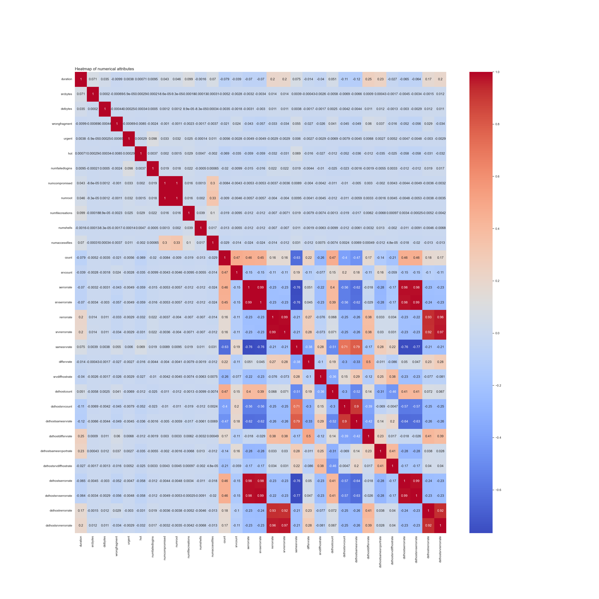
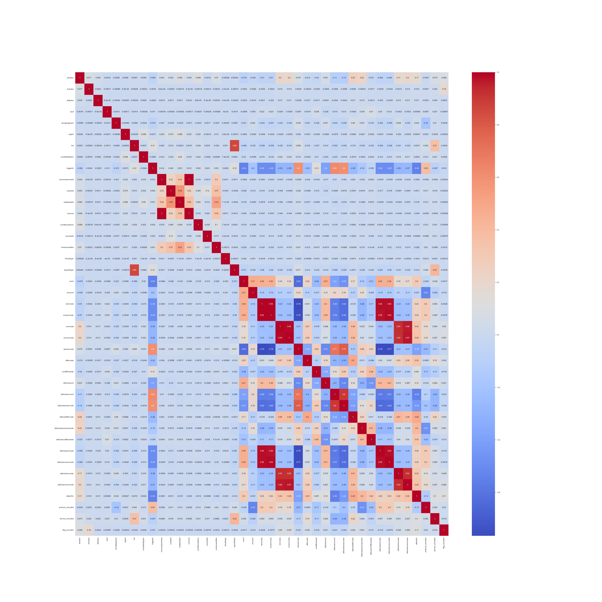
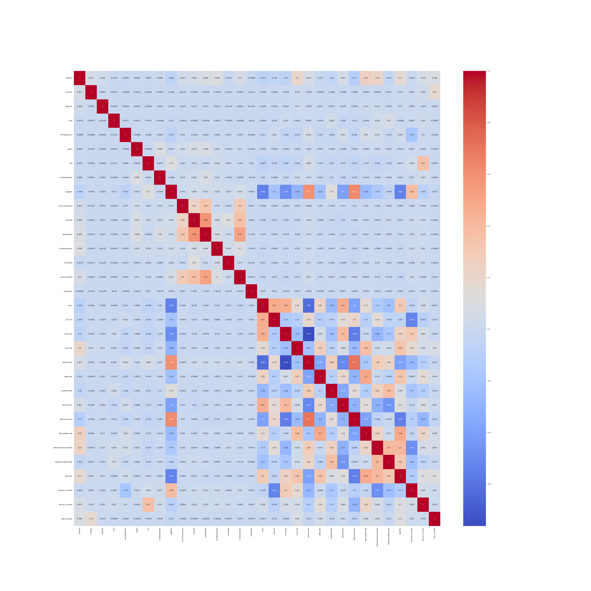
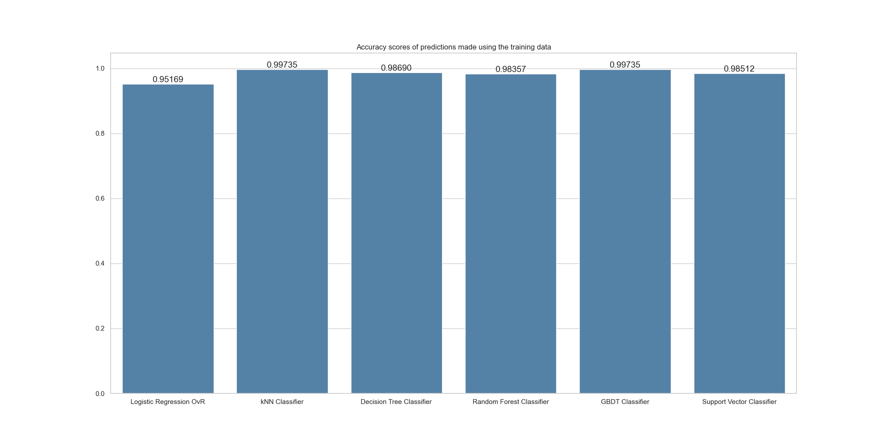
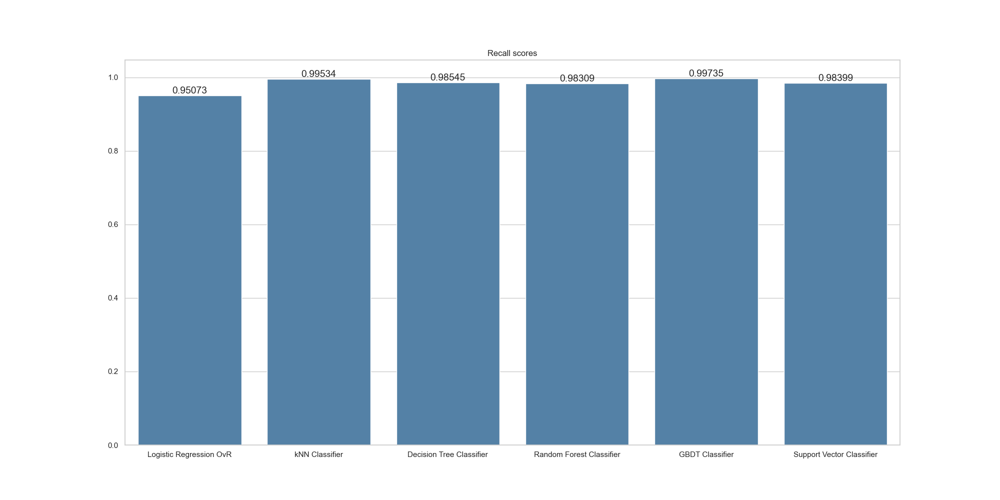
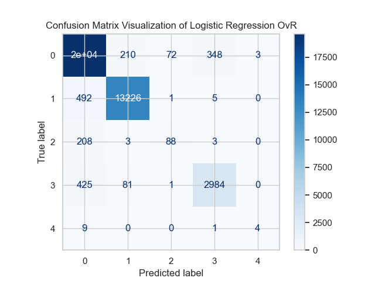
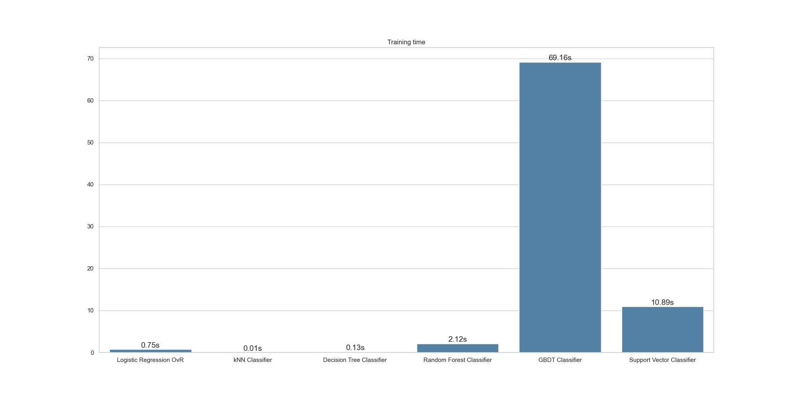
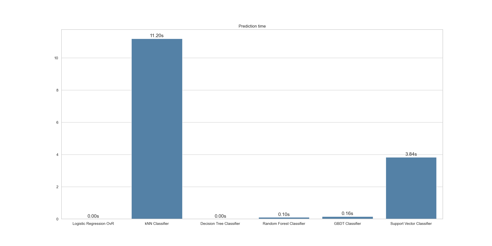

# Problem Statement and Approach

### Problem statement
In cybersecurity, detecting the anomalies in the network is a crucial task that involves identifying unusual patterns in the network traffic. The challenge lies in accurately detecting these anomalies in real-time, where the network traffic is immense, and often noisy and heterogenous.

### Why is there a need to develop a robust and adaptive system to detect anomalies in the network?
The traditional methods that are commonly deployed to detect anomalies in the network, rely on predefined set of rules based on known attack patterns. The problem with these is that they fail at recognizing threats that previously have not been encountered.

Cyber threats are evolving continuously, as in, attackers find new ways to bypass traditional security measures. Also, the network is forever growing, meaning, new devices get added to the environment every now and then. This makes the maintaining and monitoring of devices in a network crucial as the network grows in size.

These are the fundamental reasons why there is a need for a system, that is both robust and adaptive, for detecting such threats in the network.
- Robust, because it has to cater to the need of threat detection in a network that is growing continuously.
- Adaptive, because it has to continuously evolve by learning from the new data, and recognize new threats.

### Solution
One of the solutions toward addressing this problem, is to take a Machine Learning based approach. Where an ML model is built that can be fed with the data of relevant features, and the model in turn classifies the connection into either a normal or one of the attack types.

This type of classification problem in machine learning is called as a multi-class classification problem.

### Additional project info and dataset
Google Docs Link: [link](https://docs.google.com/document/d/1LCHFUQ0cULGp1zC7MrfVBTWWmnZ4L9zgYsULVCdOo5g/edit).


# Column Profile
### Basic connection features
- `duration`: Represents the length of time a specific network connection was active for.
- `protocoltype`: Represents the type of commumication protocol used in each connection.
- `service`: Represents the type of destination network service (DNS) used in a connection.
- `flag`: Represents the status of a connection as either "Normal" or "Error".
- `srcbytes`: Represents the number of data bytes transferred from the source to the destination in a single connection.
- `dstbytes`: Represents the number of data bytes transferred from the destination to the source in a single connection.
- `land`: Indicates whether the source and destination IP addresses and port numbers are equal (1 if equal, 0 otherwise).
- `wrongfragment`: Represents the total number of wrong fragments received in a connection. Wrong fragments in occur due to issues with packet transmission and reception.
- `urgent`: Represents the number of urgent packets in a connection. Urgent packets are packets with the urgent bit activated.

### Content related features
- `hot`: Represents the number of "hot" indicators in the content, such as entering a system directory, creating programs, and executing programs. The number indicates the number of features that are indicative of an anomaly or an attack.
- `numfailedlogins`: Represents the count of failed login attempts.
- `loggedin`: Indicates whether a successful login occurred in a connection (1 if successfully logged in, 0 otherwise).
- `numcompromised`: Represents the number of "compromised" conditions in a connection.
- `rootshell`: Indicates whether root shell access was obtained in a connection (1 if yes, 0 otherwise).
- `suattempted`: Indicates whether the "`su root`" command was attempted or used in a connection (1 if yes, 0 otherwise).
- `numroot`: Represents the count of root operations performed in a connection.
- `numfilecreations`: Represents the count of file creation operations in a connection.
- `numshell`: Represents the count of shell prompts in a connection.
- `numaccessfile`: Represents the count of operations on access control files in a connection.
- `numoutboundcmds`: Represents the count of outbound commands in an FTP session.
- `ishostlogin`: Indicates whether a login belongs to the host list i.e., root or admin (1 if yes, 0 otherwise).
- `isguestlogin`: Indicates whether a login belongs to the guest list (1 if yes, 0 otherwise).

### Time related traffic features
- `count`: Represents the number of connections to the same destination host as the current connection in the past 2 seconds.
- `srvcount`: Represents the number of connections to the same service as the current connection in the past 2 seconds.
- `serrorrate`: Represents the percentage of connections that have activated the flag s0, s1, s2, or s3, among the connections aggregated in `count`.
- `srvserrorrate`: Represents the percentage of connections that have activated the flag s0, s1, s2, or s3, among the connections aggregated in `srvcount`.
- `rerrorrate`: Represents the percentage of connections that have activated the flag REJ, among the connections aggregated in `count`.
- `srvserrorrate`: Represents the percentage connections that have activated the flag REJ, among the connections aggregated in `srvcount`.
- `samesrvrate`: Represents the percentage of connections that were to the same service, among the connections aggregated in `count`.
- `diffsrvrate`: Represents the percentage of connections that were to different services, among the connections aggregated in `count`.
- `srvdiffhostrate`: Represents the percentage of connections that were to different destination machines, among the connections aggregated in `srvcount`.

### Host based traffic features
- `dsthostcount`: Represents the number of connections having the same destination host IP address.
- `dsthostsrvcount`: Represents the number of connections having the same destination port number.
- `dsthostsamesrvrate`: Represents the percentage of connections that were to the same service, among the connections aggregated in `dsthostcount`.
- `dsthostdiffsrvrate`: Represents the percentage of connections that were to different services, among the connections aggregated in `dsthostcount`.
- `dsthostsamesrcportrate`: Represents the percentage connections that were to the same source port, among the connections aggregated in `dsthostsrvcount`.
- `dsthostsrvdiffhostrate`: Represents the percentage connections that were to different destination machines, among the connections aggregated in `dsthostsrvcount`.
- `dsthostserrorrate`: Represents the percentage connections that have activated the flag s0, s1, s2, or s3, among the connections aggregated in `dsthostcount`.
- `dsthostsrvserrorrate`: Represents the percentage connections that have activated the flag s0, s1, s2, or s3, among the connections aggregated in `dsthostsrvcount`.
- `dsthostrerrorrate`: Represents the percentage connections that have activated the flag REJ, among the connections aggregated in `dsthostcount`.
- `dsthostsrvrerrorrate`: Represents the percentage connections that have activated the flag REJ, among the connections aggregated in `dsthostsrvcount`.

### Others
- `attack`: Represents the specfic attack types.
- `lastflag`: Undefined.


# Data Cleaning
- Dataset used: [network_anomaly_dataset.csv](datasets/network_anomaly_dataset.csv)
- Notebook used: [data_cleaning.ipynb](notebooks/data_cleaning.ipynb)

### Creating a new column `attackhlc`
The following are the unique elements in the `attack` column:
```
array(['normal', 'neptune', 'warezclient', 'ipsweep', 'portsweep',
       'teardrop', 'nmap', 'satan', 'smurf', 'pod', 'back',
       'guess_passwd', 'ftp_write', 'multihop', 'rootkit',
       'buffer_overflow', 'imap', 'warezmaster', 'phf', 'land',
       'loadmodule', 'spy', 'perl'], dtype=object)
```
The `attack` column represents the type of attack at a much granular level.

Attacks are majorly classified as follows,
1. Normal ("normal"): These connections are considered benign and do not pose a threat.
2. Denial of Services ("dos"): These attacks aim to disrupt the normal operation of a network or system by overwhelming it with excessive traffic or malicious requests. Examples include, "neptune", "teardrop", "smurf", "pod", "back", and "land"
3. User to Root ("u2r"): These attacks exploit vulnerabilities in a system to gain unauthorized root-level access. Examples include, "rootkit", "buffer_overflow", "loadmodule", and "perl".
4. Remote to Local ("r2l"): These attacks attempt to gain unauthorized access to a system from a remote location. Examples include, "warezclient", "guess_passwd", "ftp_write", "multihop", "imap", "warezmaster", "phf", and "spy".
5. Probe ("probe"): Probing attacks, which aim to gather information about a network or system. This category includes attacks like, "ipsweep", "portsweep", "nmap", and "satan" that scan networks for vulnerabilities and gather information.

A high level classification of these attack types can be created, and elements in the `attack` column can be assigned to one of the above high level classes.

Considering all of the above, a new column, namely `attackhlc`, is created. Wherein, each element in the `attack` column has been assigned to its respective high level class.

```
attackhlc = {
    "normal": "normal",
    "neptune": "dos",
    "warezclient": "r2l",
    "ipsweep": "probe",
    "portsweep": "probe",
    "teardrop": "dos",
    "nmap": "probe",
    "satan": "probe",
    "smurf": "dos",
    "pod": "dos",
    "back": "dos",
    "guess_passwd": "r2l",
    "ftp_write": "r2l",
    "multihop": "r2l",
    "rootkit": "u2r",
    "buffer_overflow": "u2r",
    "imap": "r2l",
    "warezmaster": "r2l",
    "phf": "r2l",
    "land": "dos",
    "loadmodule": "u2r",
    "spy": "r2l",
    "perl": "u2r"
}
```

### Cleaning the `suattempted` column
The column `suattempted`, according to the column profile (https://github.com/vidishsirdesai/network_anomaly_detection?tab=readme-ov-file#column-profile), is supposed to have only 2 values, i.e., 0 and 1. But, as seen in the output of cell number `14` in the jupyter notebook ([data_cleaning.ipynb](notebooks/data_cleaning.ipynb)), it has 3 values, 0, 1, and 2.

Assuming that the presence of the value "2" in the column `suattempted` is a typo, all the rows in the column `suattempted` whereever there was a "2" present is changed to "1".

### Undefined and redundant columns
There is no description available for the feature `lastflag` in the column profile. Hence it has been dropped from the list of columns.

Also, the column `numoutboundcmds` has all zeros. This column can also be dropped from the list of columns.

### Final shape of the data after all the above changes
```
(125973, 42)
```

### Dataset post data cleaning
The dataset with all the changes made during data cleaning is stored in: [network_anomaly_dataset_cleaned.csv](datasets/network_anomaly_dataset_cleaned.csv).

The above cleaned dataset is used to create the Tableau dashboard.


# Analysis of Factors Associated with Intrusions in a Network using Tableau
- Dataset used: [network_anomaly_dataset_cleaned.csv](datasets/network_anomaly_dataset_cleaned.csv).
- Tableau Viz: 


# EDA
- Dataset used: [network_anomaly_dataset.csv](datasets/network_anomaly_dataset.csv)
- Notebook used: [eda.ipynb](notebooks/eda.ipynb)

### Columns in the data
The following are the columns present in the data,
```
Index(['duration', 'protocoltype', 'service', 'flag', 'srcbytes', 'dstbytes',
       'land', 'wrongfragment', 'urgent', 'hot', 'numfailedlogins', 'loggedin',
       'numcompromised', 'rootshell', 'suattempted', 'numroot',
       'numfilecreations', 'numshells', 'numaccessfiles', 'numoutboundcmds',
       'ishostlogin', 'isguestlogin', 'count', 'srvcount', 'serrorrate',
       'srvserrorrate', 'rerrorrate', 'srvrerrorrate', 'samesrvrate',
       'diffsrvrate', 'srvdiffhostrate', 'dsthostcount', 'dsthostsrvcount',
       'dsthostsamesrvrate', 'dsthostdiffsrvrate', 'dsthostsamesrcportrate',
       'dsthostsrvdiffhostrate', 'dsthostserrorrate', 'dsthostsrvserrorrate',
       'dsthostrerrorrate', 'dsthostsrvrerrorrate', 'attack', 'lastflag'],
      dtype='object')
```

### Shape of the data
```
(125973, 43)
```

### Summary of the DataFrame
```
<class 'pandas.core.frame.DataFrame'>
RangeIndex: 125973 entries, 0 to 125972
Data columns (total 43 columns):
 #   Column                  Non-Null Count   Dtype  
---  ------                  --------------   -----  
 0   duration                125973 non-null  int64  
 1   protocoltype            125973 non-null  object 
 2   service                 125973 non-null  object 
 3   flag                    125973 non-null  object 
 4   srcbytes                125973 non-null  int64  
 5   dstbytes                125973 non-null  int64  
 6   land                    125973 non-null  int64  
 7   wrongfragment           125973 non-null  int64  
 8   urgent                  125973 non-null  int64  
 9   hot                     125973 non-null  int64  
 10  numfailedlogins         125973 non-null  int64  
 11  loggedin                125973 non-null  int64  
 12  numcompromised          125973 non-null  int64  
 13  rootshell               125973 non-null  int64  
 14  suattempted             125973 non-null  int64  
 15  numroot                 125973 non-null  int64  
 16  numfilecreations        125973 non-null  int64  
 17  numshells               125973 non-null  int64  
 18  numaccessfiles          125973 non-null  int64  
 19  numoutboundcmds         125973 non-null  int64  
 20  ishostlogin             125973 non-null  int64  
 21  isguestlogin            125973 non-null  int64  
 22  count                   125973 non-null  int64  
 23  srvcount                125973 non-null  int64  
 24  serrorrate              125973 non-null  float64
 25  srvserrorrate           125973 non-null  float64
 26  rerrorrate              125973 non-null  float64
 27  srvrerrorrate           125973 non-null  float64
 28  samesrvrate             125973 non-null  float64
 29  diffsrvrate             125973 non-null  float64
 30  srvdiffhostrate         125973 non-null  float64
 31  dsthostcount            125973 non-null  int64  
 32  dsthostsrvcount         125973 non-null  int64  
 33  dsthostsamesrvrate      125973 non-null  float64
 34  dsthostdiffsrvrate      125973 non-null  float64
 35  dsthostsamesrcportrate  125973 non-null  float64
 36  dsthostsrvdiffhostrate  125973 non-null  float64
 37  dsthostserrorrate       125973 non-null  float64
 38  dsthostsrvserrorrate    125973 non-null  float64
 39  dsthostrerrorrate       125973 non-null  float64
 40  dsthostsrvrerrorrate    125973 non-null  float64
 41  attack                  125973 non-null  object 
 42  lastflag                125973 non-null  int64  
dtypes: float64(15), int64(24), object(4)
memory usage: 41.3+ MB
```

### Cleaning the data
The steps to clean the data in the data cleaning step (above) are applied again,
1. Creating a new column `attackhlc`.
2. Cleaning the `suattempted` column.
3. Removing the undefined and redundant columns from the DataFrame, `lastflag` and `numoutboundcmds`.

### Unique elements and number of unique elements in each column
Information regarding the number of unique elements and the unique elements in each column can be found here: [unique_attributes.txt](artifacts/unique_attributes.txt).

### Value counts and frequency of occurrence of each unique element in each column
Information regarding the value counts of each of the unique elements can be found here: [value_counts.txt](artifacts/value_counts.txt).

Additionally, the frequency of occurrence of each unique elements in each column expressed as a proportion of the total count can found here: [value_counts_normalized.txt](artifacts/value_counts_normalized.txt).

### Statistical summary of numerical columns
```
                           count          mean           std  min    25%     50%     75%           max
duration                125973.0    287.144650  2.604515e+03  0.0   0.00    0.00    0.00  4.290800e+04
srcbytes                125973.0  45566.743000  5.870331e+06  0.0   0.00   44.00  276.00  1.379964e+09
dstbytes                125973.0  19779.114421  4.021269e+06  0.0   0.00    0.00  516.00  1.309937e+09
land                    125973.0      0.000198  1.408607e-02  0.0   0.00    0.00    0.00  1.000000e+00
wrongfragment           125973.0      0.022687  2.535300e-01  0.0   0.00    0.00    0.00  3.000000e+00
urgent                  125973.0      0.000111  1.436603e-02  0.0   0.00    0.00    0.00  3.000000e+00
hot                     125973.0      0.204409  2.149968e+00  0.0   0.00    0.00    0.00  7.700000e+01
numfailedlogins         125973.0      0.001222  4.523914e-02  0.0   0.00    0.00    0.00  5.000000e+00
loggedin                125973.0      0.395736  4.890101e-01  0.0   0.00    0.00    1.00  1.000000e+00
numcompromised          125973.0      0.279250  2.394204e+01  0.0   0.00    0.00    0.00  7.479000e+03
rootshell               125973.0      0.001342  3.660284e-02  0.0   0.00    0.00    0.00  1.000000e+00
suattempted             125973.0      0.000635  2.519243e-02  0.0   0.00    0.00    0.00  1.000000e+00
numroot                 125973.0      0.302192  2.439962e+01  0.0   0.00    0.00    0.00  7.468000e+03
numfilecreations        125973.0      0.012669  4.839351e-01  0.0   0.00    0.00    0.00  4.300000e+01
numshells               125973.0      0.000413  2.218113e-02  0.0   0.00    0.00    0.00  2.000000e+00
numaccessfiles          125973.0      0.004096  9.936956e-02  0.0   0.00    0.00    0.00  9.000000e+00
ishostlogin             125973.0      0.000008  2.817483e-03  0.0   0.00    0.00    0.00  1.000000e+00
isguestlogin            125973.0      0.009423  9.661233e-02  0.0   0.00    0.00    0.00  1.000000e+00
count                   125973.0     84.107555  1.145086e+02  0.0   2.00   14.00  143.00  5.110000e+02
srvcount                125973.0     27.737888  7.263584e+01  0.0   2.00    8.00   18.00  5.110000e+02
serrorrate              125973.0      0.284485  4.464556e-01  0.0   0.00    0.00    1.00  1.000000e+00
srvserrorrate           125973.0      0.282485  4.470225e-01  0.0   0.00    0.00    1.00  1.000000e+00
rerrorrate              125973.0      0.119958  3.204355e-01  0.0   0.00    0.00    0.00  1.000000e+00
srvrerrorrate           125973.0      0.121183  3.236472e-01  0.0   0.00    0.00    0.00  1.000000e+00
samesrvrate             125973.0      0.660928  4.396229e-01  0.0   0.09    1.00    1.00  1.000000e+00
diffsrvrate             125973.0      0.063053  1.803144e-01  0.0   0.00    0.00    0.06  1.000000e+00
srvdiffhostrate         125973.0      0.097322  2.598305e-01  0.0   0.00    0.00    0.00  1.000000e+00
dsthostcount            125973.0    182.148945  9.920621e+01  0.0  82.00  255.00  255.00  2.550000e+02
dsthostsrvcount         125973.0    115.653005  1.107027e+02  0.0  10.00   63.00  255.00  2.550000e+02
dsthostsamesrvrate      125973.0      0.521242  4.489494e-01  0.0   0.05    0.51    1.00  1.000000e+00
dsthostdiffsrvrate      125973.0      0.082951  1.889218e-01  0.0   0.00    0.02    0.07  1.000000e+00
dsthostsamesrcportrate  125973.0      0.148379  3.089971e-01  0.0   0.00    0.00    0.06  1.000000e+00
dsthostsrvdiffhostrate  125973.0      0.032542  1.125638e-01  0.0   0.00    0.00    0.02  1.000000e+00
dsthostserrorrate       125973.0      0.284452  4.447841e-01  0.0   0.00    0.00    1.00  1.000000e+00
dsthostsrvserrorrate    125973.0      0.278485  4.456691e-01  0.0   0.00    0.00    1.00  1.000000e+00
dsthostrerrorrate       125973.0      0.118832  3.065575e-01  0.0   0.00    0.00    0.00  1.000000e+00
dsthostsrvrerrorrate    125973.0      0.120240  3.194594e-01  0.0   0.00    0.00    0.00  1.000000e+00
```

### Missing values
There are no missing values present in the dataset.

### Duplicate values
There are no duplicate values present in the dataset.

### Converting data type of certain numerical columns to categorical
The data type of the following numerical columns are converted to categorical,

```
to_categorical = ["land", "loggedin", "rootshell", "suattempted", "ishostlogin", "isguestlogin"]
```

The above numerical columns have discrete values of 0 and 1, hence it is appropriate to visualize the frequency of the elements in these columns after converting them to categorical data type.

### Numerical columns
```
Numerical columns:
['duration', 'srcbytes', 'dstbytes', 'wrongfragment', 'urgent', 'hot', 'numfailedlogins', 'numcompromised', 'numroot', 'numfilecreations', 'numshells', 'numaccessfiles', 'count', 'srvcount', 'serrorrate', 'srvserrorrate', 'rerrorrate', 'srvrerrorrate', 'samesrvrate', 'diffsrvrate', 'srvdiffhostrate', 'dsthostcount', 'dsthostsrvcount', 'dsthostsamesrvrate', 'dsthostdiffsrvrate', 'dsthostsamesrcportrate', 'dsthostsrvdiffhostrate', 'dsthostserrorrate', 'dsthostsrvserrorrate', 'dsthostrerrorrate', 'dsthostsrvrerrorrate']
Number of numerical columns = 31
```

### Categorical columns
```
Categorical columns:
['protocoltype', 'service', 'flag', 'land', 'loggedin', 'rootshell', 'suattempted', 'ishostlogin', 'isguestlogin', 'attack', 'attackhlc']
Number of numerical columns = 11
```

### Distribution of numerical attributes (using box plots)


### Frequencies of categorical attributes (using count plots)


### Heatmap of numerical columns


The following columns are the highly correlated as observed in the above heatmap,
- `numcompromised` and `numroot`.
- `numroot` and `numcompromised`.
- `serrorrate` and `srvserrorrate`.
- `serrorrate` and `dsthostserrorrate`.
- `serrorrate` and `dsthostsrvserrorrate`.
- `srvserrorrate` and `serrorrate`.
- `srvserrorrate` and `dsthostserrorrate`.
- `srvserrorrate` and `dsthostsrvserrorrate`.
- `rerrorrate` and `srvrerrorrate`.
- `rerrorrate` and `dsthostrerrorrate`.
- `rerrorrate` and `dsthostsrvrerrorrate`.
- `srvrerrorrate` and `rerrorrate`.
- `srvrerrorrate` and `dsthostrerrorrate`.
- `srvrerrorrate` and `dsthostsrvrerrorrate`.
- `dsthostsrvcount` and `dsthostsamesrvrate`.
- `dsthostsamesrvrate` and `dsthostsrvcount`.
- `dsthostserrorrate` and `serrorrate`.
- `dsthostserrorrate` and `srvserrorrate`.
- `dsthostserrorrate` and `dsthostsrvserrorrate`.
- `dsthostsrvserrorrate` and `serrorrate`.
- `dsthostsrvserrorrate` and `srvserrorrate`.
- `dsthostsrvserrorrate` and `dsthostserrorrate`.

Based on the above observations, the columns that can be removed from the DataFrame are,
- `numroot`.
- `srvserrorrate`.
- `dsthostserrorrate`.
- `dsthostsrvserrorrate`.
- `srvrerrorrate`.
- `dsthostrerrorrate`.
- `dsthostsrvrerrorrate`.
- `dsthostsamesrvrate`.

### Outliers
- Number of data points = 125973
- Number of outliers = 31469


# Hypothesis Testing
- Dataset used: [network_anomaly_dataset.csv](datasets/network_anomaly_dataset.csv).
- Notebook used: [hypothesis_testing.ipynb](notebooks/hypothesis_testing.ipynb).

### Creating a new column `normal_or_attack`
For the specific case of hypothesis testing, the `attack` column is used to create a new column called `normal_or_attack` which contains the values 0 or 1.

For testing the hypotheses it would be appropriate if the target column had 2 values. 0 representing normal connections, and 1 representing an attack.

This newly created column `normal_or_attack` will be the target column for the specific case of testing the different hypotheses.

### Cleaning the data
The steps to clean the data as seen in the data cleaning step (https://github.com/vidishsirdesai/network_anomaly_detection#data-cleaning) are applied again,
1. Creating a new column `attackhlc`.
2. Cleaning the `suattempted` column.
3. Removing the undefined and redundant columns, `lastflag` and `numoutboundcmds`.

### Hypothesis 1: Network connections with unusually high or low traffic volumns (bytes transferred) are more likely to be anomalous.
This hypothesis can further be simplified into 2 scenarios,
1.  Network connections with unusually high or low traffic volumes from source to destination are more likely to be anomalous.
2.  Network connections with unusually high or low traffic volumes from destination to source are more likely to be anomalous.

#### Scenario 1: Network connections with unusually high or low traffic volumes from source to destination are more likely to be anomalous.
- Null hypothesis (H0): There is no significant difference in the network traffic volume from source to destination of normal connection and an attack connection.
- Alternate hypothesis (H1): There is a significant difference in the network traffic volume from source to destination of normal connection and an attack connection.
- Test used: Independent Samples T-Test
- Significance level ($\alpha$) = 0.05
- Test result:
```
Ttest_indResult(statistic=-2.101656020563486, pvalue=0.03558539933331456)
```
- Observation: The p-value is lesser than $\alpha$. There is a significant difference in the network traffic volume from source to destination of normal connection and an attack connection. 
- Conclusion: Alternate hypothesis (H1) is true.

#### Scenario 2: Network connections with unusually high or low traffic volumes from destination to source are more likely to be anomalous.
- Null hypothesis (H0): There is no significant difference in the network traffic volume from destination to source of normal connection and an attack connection.
- Alternate hypothesis (H1): There is a significant difference in the network traffic volume from destination to source of normal connection and an attack connection.
- Test used: Independent Samples T-Test
- Significance level ($\alpha$) = 0.05
- Test result:
```
Ttest_indResult(statistic=-1.4614241258205836, pvalue=0.14390157812640425)
```
- Observation: The p-value is greater than $\alpha$. There is no significant difference in the network traffic volume from destination to source of normal connection and an attack connection.
- Conclusion: Null hypothesis (H0) is true.

### Hypothesis 2: Certain protocols are more frequently associated with network anomalies.
- Null hypothesis (H0): There is no significant difference in the likelihood of network anomalies among different protocol types.
- Alternate hypothesis (H1): There is a significant difference in the likelihood of network anomalies among different protocol types.
- Test used: Chi-Square Test for Independence
- Significance level ($\alpha$) = 0.05
- Test result:
```
Chi2ContingencyResult(statistic=10029.24862778463, pvalue=0.0, dof=2, expected_freq=array([[ 4432.22605638,  3858.77394362],
       [54895.77391187, 47793.22608813],
       [ 8015.00003175,  6977.99996825]]))
```
- Observation: The p-value is less than $\alpha$. There is a significant difference in the likelihood of network anomalies among different protocol types.
- Conclusion: Alternate hypothesis (H1) is true.

### Hypothesis 3: Specific services are targets of network anomalies more often than others.
- Null hypothesis (H0): There is no significant difference in the likelihood of network anomalies among different services.
- Alternate hypothesis (H1): There is a significant difference in the likelihood of network anomalies among different services.
- Test used: Chi-Square Test for Independence
- Significance level ($\alpha$) = 0.05
- Test result:
```
Chi2ContingencyResult(statistic=93240.03213516614, pvalue=0.0, dof=69, expected_freq=array([[9.99669850e+01, 8.70330150e+01],
       [3.90245449e+01, 3.39754551e+01],
       [4.60810380e+02, 4.01189620e+02],
       [1.06916561e+00, 9.30834385e-01],
       [5.10526581e+02, 4.44473419e+02],
       [3.79553793e+02, 3.30446207e+02],
       [3.92383781e+02, 3.41616219e+02],
       [2.91347630e+02, 2.53652370e+02],
       [3.00970121e+02, 2.62029879e+02],
       [2.78517643e+02, 2.42482357e+02],
       [2.87605550e+02, 2.50394450e+02],
       [3.04177617e+02, 2.64822383e+02],
       [4.83423233e+03, 4.20876767e+03],
       [2.32008938e+02, 2.01991062e+02],
       [2.45159675e+03, 2.13440325e+03],
       [1.64491130e+03, 1.43208870e+03],
       [2.59272662e+02, 2.25727338e+02],
       [2.53392251e+02, 2.20607749e+02],
       [9.44607821e+02, 8.22392179e+02],
       [9.37658244e+02, 8.16341756e+02],
       [3.66723806e+03, 3.19276194e+03],
       [2.76913894e+02, 2.41086106e+02],
       [1.06916561e+00, 9.30834385e-01],
       [2.45908091e+02, 2.14091909e+02],
       [2.15640013e+04, 1.87739987e+04],
       [5.34582807e-01, 4.65417193e-01],
       [2.83328888e+02, 2.46671112e+02],
       [1.06916561e+00, 9.30834385e-01],
       [3.45875076e+02, 3.01124924e+02],
       [3.67258389e+02, 3.19741611e+02],
       [2.31474356e+02, 2.01525644e+02],
       [1.59840259e+02, 1.39159741e+02],
       [2.19178951e+02, 1.90821049e+02],
       [2.53926834e+02, 2.21073166e+02],
       [2.29336024e+02, 1.99663976e+02],
       [2.34681852e+02, 2.04318148e+02],
       [2.41096846e+02, 2.09903154e+02],
       [2.16506037e+02, 1.88493963e+02],
       [1.85500234e+02, 1.61499766e+02],
       [1.93518976e+02, 1.68481024e+02],
       [1.92449811e+02, 1.67550189e+02],
       [3.36787169e+02, 2.93212831e+02],
       [1.58236511e+02, 1.37763489e+02],
       [8.98099116e+01, 7.81900884e+01],
       [2.33024646e+03, 2.02875354e+03],
       [2.67291404e+00, 2.32708596e+00],
       [4.16974590e+01, 3.63025410e+01],
       [1.41129861e+02, 1.22870139e+02],
       [3.68862137e+01, 3.21137863e+01],
       [1.16822381e+04, 1.01707619e+04],
       [4.27666246e+00, 3.72333754e+00],
       [4.16974590e+01, 3.63025410e+01],
       [4.59741214e+01, 4.00258786e+01],
       [3.47478825e+01, 3.02521175e+01],
       [3.90940407e+03, 3.40359593e+03],
       [1.30972788e+02, 1.14027212e+02],
       [1.66255253e+02, 1.44744747e+02],
       [2.03676050e+02, 1.77323950e+02],
       [2.90813047e+02, 2.53186953e+02],
       [2.54995999e+02, 2.22004001e+02],
       [1.25787335e+03, 1.09512665e+03],
       [1.60374842e+00, 1.39625158e+00],
       [4.27666246e+00, 3.72333754e+00],
       [3.49617156e+02, 3.04382844e+02],
       [5.34582807e+00, 4.65417193e+00],
       [3.21818850e+02, 2.80181150e+02],
       [4.16974590e+02, 3.63025410e+02],
       [3.68327554e+02, 3.20672446e+02],
       [3.29837592e+02, 2.87162408e+02],
       [3.70465886e+02, 3.22534114e+02]]))
```
- Observation: The p-value is less than $\alpha$. There is a significant difference in the likelihood of network anomalies among different services.
- Conclusion: Alternate hypothesis (H1) is true.

### Hypothesis 4: Error flags in the Flag feature are significantly associated with anomalies.
- Null hypothesis (H0): There is no significant difference in the likelihood of network anomalies between connections with and without error flags.
- Alternate hypothesis (H1): There is a significant difference in the likelihood of network anomalies between connections with and without error flags.
- Test used: Logistic Regression model using `statsmodels.api.Logit`.
- Significance level ($\alpha$) = 0.05
- Test result:
```
                           Logit Regression Results                           
==============================================================================
Dep. Variable:       normal_or_attack   No. Observations:                88181
Model:                          Logit   Df Residuals:                    88155
Method:                           MLE   Df Model:                           25
Date:                Sun, 27 Oct 2024   Pseudo R-squ.:                  0.7459
Time:                        16:59:42   Log-Likelihood:                -15478.
converged:                       True   LL-Null:                       -60904.
Covariance Type:            nonrobust   LLR p-value:                     0.000
==============================================================================
                 coef    std err          z      P>|z|      [0.025      0.975]
------------------------------------------------------------------------------
x1            -0.2132      0.014    -15.665      0.000      -0.240      -0.187
x2             0.5772      0.269      2.149      0.032       0.051       1.104
x3             1.0158      0.509      1.997      0.046       0.019       2.013
x4            -0.0150      0.013     -1.192      0.233      -0.040       0.010
x5             2.7225      2.866      0.950      0.342      -2.894       8.339
x6             0.0076      0.009      0.805      0.421      -0.011       0.026
x7             0.3983      0.011     36.480      0.000       0.377       0.420
x8             0.0388      0.009      4.135      0.000       0.020       0.057
x9            -0.0976      0.072     -1.364      0.173      -0.238       0.043
x10            0.0743      0.013      5.537      0.000       0.048       0.101
x11           -0.1199      0.037     -3.226      0.001      -0.193      -0.047
x12           -0.1366      0.041     -3.335      0.001      -0.217      -0.056
x13           -0.0058      0.010     -0.602      0.547      -0.025       0.013
x14           -0.1367      0.040     -3.393      0.001      -0.216      -0.058
x15         -693.5490     77.317     -8.970      0.000    -845.087    -542.011
x16            7.6434      0.135     56.446      0.000       7.378       7.909
x17           -4.3413      0.086    -50.263      0.000      -4.511      -4.172
x18            0.0511      0.012      4.161      0.000       0.027       0.075
x19            0.3185      0.013     24.053      0.000       0.293       0.344
x20            0.7644      0.020     37.865      0.000       0.725       0.804
x21           -1.5790      0.024    -66.967      0.000      -1.625      -1.533
x22           -0.2248      0.016    -14.410      0.000      -0.255      -0.194
x23            0.8640      0.014     60.496      0.000       0.836       0.892
x24            0.7041      0.017     42.544      0.000       0.672       0.737
x25           -0.7929      0.024    -33.503      0.000      -0.839      -0.746
x26            4.3007      0.144     29.876      0.000       4.019       4.583
==============================================================================
```
- Observation:
       - The `flag` attribute is represented by "x26" in the above table.
       - The coefficient of this attribute is positive, and is also statistically significant (p-value < 0.05).
       - This indicates that the `flag` attribute is positively is associated with the anomalies.
- Conclusion: Alternate hypothesis (H1) is true.


### Hypothesis 5: Connections that include urgent packets are more likely to be anomolous.
- Null hypothesis (H0): There is no significant difference in the likelihood of network anomalies between connections with and without urgent packets.
- Alternate hypothesis (H1): There is a significant difference in the likelihood of network anomalies between connections with and without urgent packets.
- Test used: Logistic Regression model using `statsmodels.api.Logit`.
- Significance level ($\alpha$) = 0.05
- Test result:
```
                           Logit Regression Results                           
==============================================================================
Dep. Variable:       normal_or_attack   No. Observations:                88181
Model:                          Logit   Df Residuals:                    88155
Method:                           MLE   Df Model:                           25
Date:                Sun, 27 Oct 2024   Pseudo R-squ.:                  0.7459
Time:                        16:59:42   Log-Likelihood:                -15478.
converged:                       True   LL-Null:                       -60904.
Covariance Type:            nonrobust   LLR p-value:                     0.000
==============================================================================
                 coef    std err          z      P>|z|      [0.025      0.975]
------------------------------------------------------------------------------
x1            -0.2132      0.014    -15.665      0.000      -0.240      -0.187
x2             0.5772      0.269      2.149      0.032       0.051       1.104
x3             1.0158      0.509      1.997      0.046       0.019       2.013
x4            -0.0150      0.013     -1.192      0.233      -0.040       0.010
x5             2.7225      2.866      0.950      0.342      -2.894       8.339
x6             0.0076      0.009      0.805      0.421      -0.011       0.026
x7             0.3983      0.011     36.480      0.000       0.377       0.420
x8             0.0388      0.009      4.135      0.000       0.020       0.057
x9            -0.0976      0.072     -1.364      0.173      -0.238       0.043
x10            0.0743      0.013      5.537      0.000       0.048       0.101
x11           -0.1199      0.037     -3.226      0.001      -0.193      -0.047
x12           -0.1366      0.041     -3.335      0.001      -0.217      -0.056
x13           -0.0058      0.010     -0.602      0.547      -0.025       0.013
x14           -0.1367      0.040     -3.393      0.001      -0.216      -0.058
x15         -693.5490     77.317     -8.970      0.000    -845.087    -542.011
x16            7.6434      0.135     56.446      0.000       7.378       7.909
x17           -4.3413      0.086    -50.263      0.000      -4.511      -4.172
x18            0.0511      0.012      4.161      0.000       0.027       0.075
x19            0.3185      0.013     24.053      0.000       0.293       0.344
x20            0.7644      0.020     37.865      0.000       0.725       0.804
x21           -1.5790      0.024    -66.967      0.000      -1.625      -1.533
x22           -0.2248      0.016    -14.410      0.000      -0.255      -0.194
x23            0.8640      0.014     60.496      0.000       0.836       0.892
x24            0.7041      0.017     42.544      0.000       0.672       0.737
x25           -0.7929      0.024    -33.503      0.000      -0.839      -0.746
x26            4.3007      0.144     29.876      0.000       4.019       4.583
==============================================================================
```
- Observation:
       - The `urgent` attribute is represented by "x6" in the above table.
       - Although the coefficient of this attribute is positive, is is not statistically significant (p-value > 0.05).
       - This suggests that while there might be a slight positive association between urgent packets and anomalies, but the evidence is not strong enough to conclude a significant relationship.
- Conclusion: Null hypothesis (H0) is true.


# Data Preprocessing
- Dataset used: [network_anomaly_dataset.csv](datasets/network_anomaly_dataset.csv)
- Notebook used: [ml_data_preprocessing.ipynb](notebooks/ml_data_preprocessing.ipynb)

### Cleaning the data
The steps to clean the data in the data cleaning step (above) are applied again,
1. Creating a new column `attack_hlc`.
2. Cleaning the `suattempted` column.
3. Removing the undefined and redundant columns, `lastflag` and `numoutboundcmds`.
4. Missing and duplicate values are dealt with.

### Encoding the categorical columns
The following are the categorical columns and the type of encoding applied,
- `attackhlc`: Label encoding.
- `protocoltype`: Target encoding.
- `service`: Target encoding.
- `flag`: Target encoding.

### Removing the highly correlated columns
The following is the heatmap showing the correlation of columns after the encoding is done,


The following columns are the highly correlated as observed in the above heatmap,
- `hot` and `isguestlogin`.
- `numcompromised` and `numroot`.
- `numroot` and `numcompromised`.
- `serrorrate` and `srvserrorrate`.
- `serrorrate` and `dsthostserrorrate`.
- `serrorrate` and `dsthostsrvserrorrate`.
- `srvserrorrate` and `serrorrate`.
- `srvserrorrate` and `dsthostserrorrate`.
- `srvserrorrate` and `dsthostsrvserrorrate`.
- `rerrorrate` and `srvrerrorrate`.
- `rerrorrate` and `dsthostrerrorrate`.
- `rerrorrate` and `dsthostsrvrerrorrate`.
- `srvrerrorrate` and `rerrorrate`.
- `srvrerrorrate` and `dsthostrerrorrate`.
- `srvrerrorrate` and `dsthostsrvrerrorrate`.
- `dsthostsrvcount` and `dsthostsamesrvrate`.
- `dsthostsamesrvrate` and `dsthostsrvcount`.
- `dsthostserrorrate` and `serrorrate`.
- `dsthostserrorrate` and `srvserrorrate`.
- `dsthostserrorrate` and `dsthostsrvserrorrate`.
- `dsthostsrvserrorrate` and `serrorrate`.
- `dsthostsrvserrorrate` and `srvserrorrate`.
- `dsthostsrvserrorrate` and `dsthostserrorrate`.

Based on the above observations, the columns that can be removed from the DataFrame are,
- `isguestlogin`.
- `numroot`.
- `srvserrorrate`.
- `dsthostserrorrate`.
- `dsthostsrvserrorrate`.
- `srvrerrorrate`.
- `dsthostrerrorrate`.
- `dsthostsrvrerrorrate`.
- `dsthostsamesrvrate`.

The following is the heatmap after the highly correlated columns are removed,


### Independent and dependent variables (columns)
The `attackhlc` (which is label encoded), is the target or the dependent variable for the ML models that will be built.

The independent variables are stored in a variable named, `x`, and the dependent variable is stored in a variable named, `y`. Refer cell number `34` in the jupyter notebook (link above).

### Splitting the dataset into training set, validation set and testing set
The `x` and `y` are split into,
- `x_train`
- `x_val`
- `x_test`
- `y_train`
- `y_val`
- `y_test`

Shape of the training (x_train and y_train) set,
```
((88174, 31), (88174,))
```

Shape of testing (x_test and y_test) set,
```
((37790, 31), (37790,))
```

The data containing the independent variables and dependent variables is stored in the following .csv files,
- `x`: [x.csv](datasets/x.csv)
- `y`: [y.csv](datasets/y.csv)

The split data is stored in the following .csv files,
- `x_train`: [x_train.csv](datasets/x_train.csv)
- `x_test`: [x_test.csv](datasets/x_test.csv) 
- `y_train`: [y_train.csv](datasets/y_train.csv)
- `y_test`: [y_test.csv](datasets/y_test.csv)


# Model Building
- Dataset used:
    - `x_train`: [x_train.csv](datasets/x_train.csv)
    - `x_test`: [x_test.csv](datasets/x_test.csv) 
    - `y_train`: [y_train.csv](datasets/y_train.csv)
    - `y_test`: [y_test.csv](datasets/y_test.csv)
- Notebook used: [ml_model_building.ipynb](notebooks/ml_model_building.ipynb)
- Problem type: Multi-class classification.
- Models built: 
       - Logistic Regression OvR
       - kNN Classifier
       - Decision Tree Classifier
       - Random Forest Classifier
       - Gradient Boosting Decision Tree (GBDT) Classifier
       - Support Vector Classifier

### Scaling the data
The `x_train` and `x_test` data have been scaled using `StandardScaler()`,
- `fit_transform()` method is used to scale `x_train`. The result is stored in `x_train_scaled`.
- `transform()` method is used to scale `x_test`. The result is stored in `x_test_scaled`.

### Comparison of accuracy scores of the various models of predictions made using the training data


### Comparison of accuracy scores of the various models of predictions made using the testing data


### Comparison of precision scores of the various models


### Comparison of recall scores of the various models


### Comparison of F1 scores of the various models


### Comparison of confusion matrices of the various models
Logistic Regression OvR,



kNN Classifier,


Decision Tree Classifier,


Random Forest Classifier,


Gradient Boosting Decision Tree (GBDT) Classifier,


Support Vector Classifier,


### Comparison of classification reports of the various models
Logistic Regression OvR ([classification_report_log_reg_ovr.txt](artifacts/classification_report_log_reg_ovr.txt)),
```
              precision    recall  f1-score   support

           0       0.95      0.97      0.96     20259
           1       0.98      0.96      0.97     13724
           2       0.54      0.29      0.38       302
           3       0.89      0.85      0.87      3491
           4       0.57      0.29      0.38        14

    accuracy                           0.95     37790
   macro avg       0.79      0.67      0.71     37790
weighted avg       0.95      0.95      0.95     37790
```

kNN Classifier ([classification_report_knn_classifier.txt](artifacts/classification_report_knn_classifier.txt)),
```
              precision    recall  f1-score   support

           0       1.00      1.00      1.00     20259
           1       1.00      1.00      1.00     13724
           2       0.92      0.91      0.92       302
           3       0.99      0.99      0.99      3491
           4       0.67      0.29      0.40        14

    accuracy                           1.00     37790
   macro avg       0.91      0.84      0.86     37790
weighted avg       1.00      1.00      1.00     37790
```

Decision Tree Classifier ([classification_report_dt_classifier.txt](artifacts/classification_report_dt_classifier.txt)),
```
              precision    recall  f1-score   support

           0       0.99      0.99      0.99     20259
           1       0.99      0.99      0.99     13724
           2       0.84      0.76      0.80       302
           3       0.95      0.94      0.95      3491
           4       0.00      0.00      0.00        14

    accuracy                           0.99     37790
   macro avg       0.75      0.74      0.75     37790
weighted avg       0.98      0.99      0.99     37790
```

Random Forest Classifier ([classification_report_rf_classifier.txt](artifacts/classification_report_rf_classifier.txt)),
```
              precision    recall  f1-score   support

           0       0.97      1.00      0.98     20259
           1       1.00      0.99      0.99     13724
           2       0.00      0.00      0.00       302
           3       1.00      0.95      0.97      3491
           4       0.00      0.00      0.00        14

    accuracy                           0.98     37790
   macro avg       0.59      0.59      0.59     37790
weighted avg       0.98      0.98      0.98     37790
```

Gradient Boosting Decision Tree (GBDT) Classifier ([classification_report_gbdt_classifier.txt](artifacts/classification_report_gbdt_classifier.txt)),
```
              precision    recall  f1-score   support

           0       1.00      1.00      1.00     20259
           1       1.00      1.00      1.00     13724
           2       1.00      0.93      0.96       302
           3       1.00      0.99      0.99      3491
           4       0.24      0.50      0.33        14

    accuracy                           1.00     37790
   macro avg       0.85      0.88      0.86     37790
weighted avg       1.00      1.00      1.00     37790
```

Support Vector Classifier ([classification_report_sv_classifier.txt](artifacts/classification_report_sv_classifier.txt)),
```
              precision    recall  f1-score   support

           0       0.98      0.99      0.99     20259
           1       1.00      0.99      0.99     13724
           2       0.88      0.81      0.85       302
           3       0.98      0.94      0.96      3491
           4       0.43      0.21      0.29        14

    accuracy                           0.98     37790
   macro avg       0.85      0.79      0.81     37790
weighted avg       0.98      0.98      0.98     37790
```

### Comparison of training time of the various models


### Comparison of prediction time on test dataset of the various models


### Best model
The confusion matrix obtained from GBDT classifier has most of the predictions falling on the diagonal of the matrix, indicating correct classification. This is the best of all other confusion matrices obtained from all other models.

The model has the best precision score, recall score, and F1 score compared to all other models.

Although GBDT Classifier has the highest training time, the prediction time is quick.

Therefore, considering all of the above, GBDT classifier is the best out of all the models.


# Model Deployment using Flask

### Virtual environment setup
1. `cd <project_folder_path>`.
2. `pip install virtualenv`.
3. `python<version> -m venv <virtual_environment_name>` or `python3 -m venv .venv`.
4. A folder named ".venv" will appear in your project.
5. Activate the virtual environment using one of the commands listed below depending on the Operating System,
    - MacOS and Linux, `source .venv/bin/activate`.
    - Windows command prompt, `.venv/Scripts/activate.bat`.
6. Once the virtual environment is active, the environment name (in this case "`.venv`") will be visible in the parantheses before the prompt, like so "`(.venv)`".
7. To confirm if the virtual environment has successfully been create, run `pip list`. The following should be the output,
```text
(.venv) vidish@Vidishs-MacBook-Air network_anomaly_detection % pip list
Package    Version
---------- -------
pip        xx.x.x
setuptools xx.x.x
``` 
8. To deactivate the virtual environment, strictly run the following 2 commands in the same order,
    - `deactivate`.
    - `rm -r .venv`.

### Installing dependencies
1. Once the virtual environment is created, create a `.txt` file named, `requirement.txt`.
2. Add the dependent (required) packages (libraries) that are required by the app to be functioning. The below is the list of packages that are required,
```text
flask
pickle
pandas
scikit-learn
```
3. Once the `requirement.txt` file is created with all the dependencies included as a part of the file, save the file and run `pip install -r requirements.txt` from the terminal.
4. `pip list` can be run to check if the installation of all the packages has been successful.

### Network anomaly classification model
Gradient boosting decision tree was found to be the best model. Therefore, the same is chosen to build the classification app. The model is trained and the trained model is serialized using "`pickle`".

`pickle` is a Python package that is a powerful tool for serializing and deserializing the Python objects.

Refer the following notebook where all of the above has been executed, 
- Notebook: [gbdt_classifier.ipynb](notebooks/gbdt_classifier.ipynb).

### Network anomaly classifier app
1. Create a python file named, `network_attack_classifier.py`.
2. The contents of the file can be viewed here: [network_attack_classifier.py](src/network_attack_classifier.py).
3. To run the application,
    - `cd src`.
    - `FLASK_APP=network_attack_classifier_app.py flask run`.
4. To view the welcome page, goto, http://127.0.0.1:5000.
5. To classify the anomaly type or the attack type, send a POST request to, http://127.0.0.1:5000/classify_attack_type.
6. The POST request can be sent by running the following command in the terminal: 
```
curl -X POST -H 'Content-Type: application/json' -d '{"duration": 38044, "srcbytes": 1, "dstbytes": 0, "land": 0, "wrongfragment": 0, "urgent": 0, "hot": 0, "numfailedlogins": 0, "loggedin": 0, "numcompromised": 0, "rootshell": 0, "suattempted": 0, "numfilecreations": 0, "numshells": 0, "numaccessfiles": 0, "ishostlogin": 0, "count": 2, "srvcount": 2, "serrorrate": 0.0, "rerrorrate": 1.0, "samesrvrate": 1.0, "diffsrvrate": 0.0, "srvdiffhostrate": 0.0, "dsthostcount": 255, "dsthostsrvcount": 2, "dsthostdiffsrvrate": 0.5, "dsthostsamesrcportrate": 1.0, "dsthostsrvdiffhostrate": 0.0, "protocol": "tcp", "service": "Z39_50", "flag": "RSTR"}' http://127.0.0.1:5000/classify_attack_type
```
7. Expected response: `{"Attack Type":"Probe"}`.

# API Specification

### Base URL
http://127.0.0.1:5000/

### Endpoints
- GET /: Returns a welcome message indicating the applications's purpose.
- POST /classify_attack_type: Classifies a network connection based on its features and predicts the type of attack (if any).

### Request format for POST /classify_attack_type
Content-Type: application/json

The request body should be a JSON object containing the following features of a network connection,
- `duration` (int): Length of time a specific network connection was active for.
- `srcbytes` (int): Number of data bytes transferred from the source to the destination in a single connection.
- `dstbytes` (int): Number of data bytes transferred from the destination to source in a single connection.
- `land` (int): Indicates whether the source and destination IP addresses and port numbers are equal (1 if equal, 0 otherwise).
- `worngfragment` (int): Total number of worng fragments received in a connection.
- `urgent` (int): Number of urgent packets in this connection. Urgent packets are packets with the urgent bit activated.
- `hot` (int): Number of "hot" indicators, meaning the number of factors that are indicative of an anomaly or an attack.
- `numfailedlogins` (int): Count of failed login attempts.
- `loggedin` (int): Indicates whether a successful login occurred in a connection (1 if successfully logged in, 0 otherwise).
- `numcompromised` (int): Number of compromised conditions in a connection.
- `rootshell` (int): Indicates whether root shell access was obtained in a connection (1 if yes, 0 otherwise).
- `suattempted` (int): Indicates whether the `su root` command was attempted or used in a connection (1 if yes, 0 otherwise).
- `numfilecreations` (int): Count of file creation operations in a connection.
- `numshells` (int): Count of shell prompts in a connection.
- `numaccessfiles` (int): Count of operations on access control files in a connection.
- `ishostlogin` (int): Indicates whether a login belongs to the host list i.e., root or admin (1 if yes, 0 otherwise).
- `count` (int): Number of connections to the same destination host as the current connection in the past 2 seconds.
- `srvcount` (int): Number of connections to the same service as the current connection in the past 2 seconds.
- `serrorrate` (float): Percentage of connections that have activated the flag s0, s1, s2, or s3, among the connections aggregated in `count`.
- `rerrorrate` (float): Percentage of connections that have activated the flag REJ, among the connections aggregated in `count`.
- `samesrvrate` (float): Percentage of connections that were to the same service, among the connections aggregated in `count`.
- `diffsrvrate` (float): Percentage of connections that were to different services, among the connections aggregated in `count`.
- `srvdiffhostrate` (float): Percentage of connections that were to different destination machines, among the connections aggregated in `srvcount`.
- `dsthostcount` (int): Number of connections having the same destination host IP address.
- `dsthostsrvcount` (int): Number of connections having the same destination port number.
- `dsthostdiffsrvrate` (float): Percentage of connections that were to different services, among the connections aggregated in `dsthostcount`.
- `dsthostsamesrcportrate` (float): Percentage connections that were to the same source port, among the connections aggregated in `dsthostsrvcount`.
- `dsthostsrvdiffhostrate` (float): Percentage connections that were to different destination machines, among the connections aggregated in `dsthostsrvcount`.
- `protocol` (string): Type of communication protocol used in each connection.
- `service` (string): Type of DNS used in a connection.
- `flag` (string): Status of a connection.

### Response format for POST /classify_attack_type
The response will be a JSON object with the following key,
- Attack Type: A string indicating one of the predicted type of attack,
    - "Normal".
    - "DoS".
    - "R2L".
    - "Probe".
    - "U2R".
    - "Not recognized" (if the model cannot classify the attack type).
